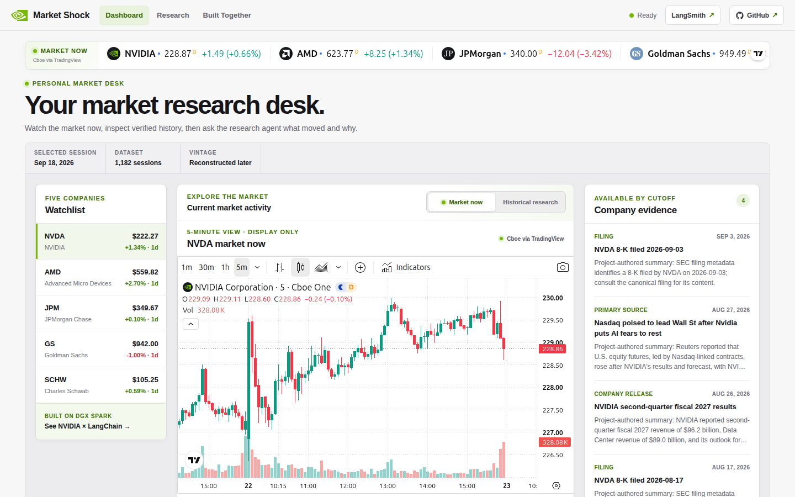
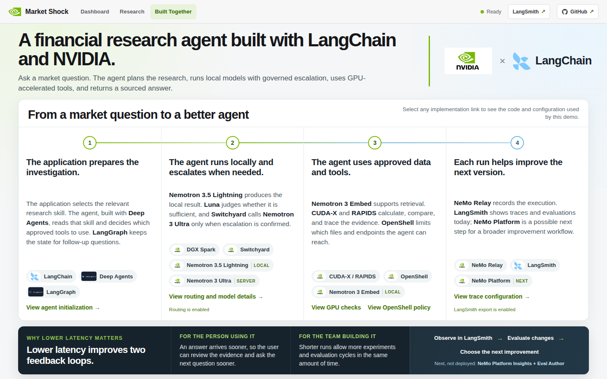
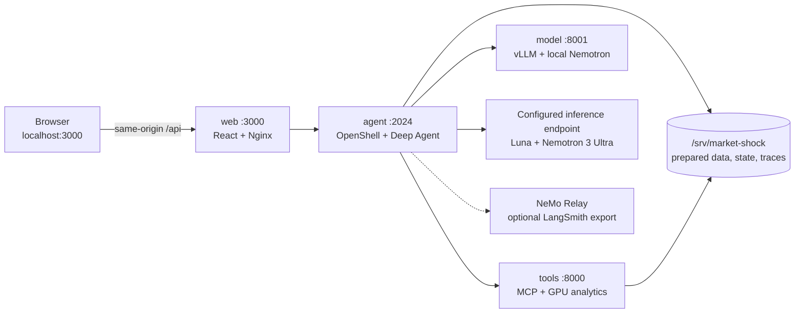

<p align="center">
  <a href="https://www.nvidia.com/en-us/products/workstations/dgx-spark/">
    
  </a>
  &nbsp;&nbsp;&nbsp;&nbsp;&nbsp;×&nbsp;&nbsp;&nbsp;&nbsp;&nbsp;
  <a href="https://www.langchain.com/">
    
  </a>
</p>

<h1 align="center">Market Shock Investigator</h1>

<p align="center">
  A local-first financial research agent built with NVIDIA and LangChain technologies.
</p>

<p align="center">
  <code>DGX Spark</code> · <code>Deep Agents</code> · <code>Nemotron</code> ·
  <code>RAPIDS</code> · <code>Switchyard</code> · <code>OpenShell</code>
</p>

Market Shock Investigator turns a known market event—or a supported ticker,
date, and question—into an evidence-linked historical equity investigation. A
LangChain Deep Agent selects a research skill, decides which GPU-accelerated
tools to use, and returns a sourced answer alongside an interactive execution
timeline.

> **Demo status:** this repository is a supervised booth demo and proof of life,
> validated for one prepared NVIDIA DGX Spark. It is not a hosted service, a
> multi-user deployment, a live trading system, or investment advice.

<p align="center">
  
</p>

## What the demo shows

- **A real agent, not a canned answer path.** LangChain Deep Agents plans each
  investigation, reads one versioned skill, calls only the tools available to
  that skill, and completes through a typed answer submission.
- **Local inference with governed escalation.** Nemotron 3.5 Lightning runs on
  DGX Spark. NeMo Switchyard evaluates each Deep Agent reasoning turn and can escalate
  to Nemotron 3 Ultra through a configured inference endpoint.
- **GPU-backed financial evidence.** Typed MCP tools use cuDF, cuVS, cuGraph,
  cuML, CUDA XGBoost, and Nemotron embeddings for market calculations,
  retrieval, similarity, graph, topic, and risk workflows.
- **Point-in-time research boundaries.** Curated events pin companies, market
  windows, and evidence cutoffs. Tools reject evidence that was unavailable by
  the selected cutoff instead of silently filling gaps.
- **Visible work and latency.** The UI streams the investigation, renders
  citations and uncertainty, and exposes a hoverable Gantt view of policy,
  model, tool, and presentation spans.
- **A contained agent runtime.** NVIDIA OpenShell 0.0.116 owns the agent process,
  limits its files and endpoints, and provides no unsandboxed fallback.

### Built together

| LangChain | NVIDIA |
| --- | --- |
| [Deep Agents](https://docs.langchain.com/oss/python/deepagents/overview) supplies the skill-guided, tool-using agent harness. | [DGX Spark](https://www.nvidia.com/en-us/products/workstations/dgx-spark/) hosts local inference, the application, and GPU data work. |
| [LangGraph](https://docs.langchain.com/oss/python/langgraph/overview) provides the durable execution runtime beneath the agent. | Nemotron 3.5 Lightning, Nemotron 3 Embed, and Nemotron 3 Ultra cover efficient reasoning, retrieval, and capable escalation. |
| [LangSmith](https://docs.langchain.com/langsmith/observability) provides an optional destination for correlated traces. | NeMo Switchyard routes model turns; NeMo Relay traces them; OpenShell contains the agent; CUDA-X and RAPIDS accelerate its tools. |

## Experience

The application has three connected views:

1. **Dashboard** — inspect a personal market desk with a watchlist, historical
   context, company evidence, and an optional display-only live market widget.
2. **Research** — choose a curated shock event or define a supported custom
   scope, ask a suggested or free-text question, inspect the answer and sources,
   then continue with a follow-up.
3. **Built Together** — walk through how LangChain and NVIDIA technologies take
   an investigation from question to evidence-backed answer.

<table>
  <tr>
    <td width="50%"></td>
    <td width="50%"></td>
  </tr>
  <tr>
    <td align="center"><strong>Personal market dashboard</strong></td>
    <td align="center"><strong>NVIDIA × LangChain story</strong></td>
  </tr>
</table>

Supported research modes include market-dislocation analysis, peer comparison,
historical analogues, bounded shock-propagation paths, volatility-risk context,
and evidence-theme mapping. Out-of-scope questions receive guidance instead of a
general-purpose answer.

## Architecture



There are exactly four application roles:

| Role | Responsibility | Boundary |
| --- | --- | --- |
| `web:3000` | React UI and same-origin API proxy | The only host-published application port |
| `agent:2024` | Deep Agent, skills, routing, tracing, REST/SSE, and encrypted state | Runs only inside the prepared OpenShell sandbox |
| `tools:8000` | Seven typed, read-only MCP tools | Reachable by the agent on the private backend |
| `model:8001` | Local Nemotron generation through vLLM | Reachable by the agent on the private backend |

The browser never receives model, MCP, or credential details. Docker Compose
runs `web`, `tools`, and `model`; its `agent` service is image-only because
OpenShell owns the running agent. Relay records the correlated agent/model/tool
hierarchy locally and can export it to LangSmith when configured.

### Investigation flow

1. The server resolves the event or custom scope and freezes its evidence cutoff.
2. The runtime exposes one research skill and that skill's allowed MCP tools.
3. `create_deep_agent` builds the agent with Relay and
   `SwitchyardRoutingMiddleware`.
4. Every Deep Agent reasoning call passes through Switchyard. Luna judges whether the
   local Lightning result is sufficient or Ultra should run.
5. The agent chooses evidence tools, reviews their typed results, and calls
   `submit_answer` with citations produced by that investigation.
6. The UI streams the answer, evidence, uncertainty, and timing trace. Long,
   structured answers may receive a separate Ultra layout-only pass; facts and
   source ordering remain fixed.

For the full trust and data-flow model, see
[Architecture](docs/ARCHITECTURE.md).

## Models

In the deployed demo, local model artifacts are pinned to immutable revisions
and served from DGX Spark. Model weights are not stored in this repository.
Remote models are available only to the sandboxed agent through the configured
endpoint.

| Location | Role | Exact model |
| --- | --- | --- |
| DGX Spark | Efficient agent target | `nvidia/NVIDIA-Nemotron-3.5-Lightning-30B-A3B-NVFP4@bee7596271d1495f6992ae224aefde4410e816b8` |
| DGX Spark | Three-token speculative draft | `nvidia/NVIDIA-Nemotron-3.5-Lightning-30B-A3B-NVFP4-DSpark@8a0177116d138011e63103110f136ec0ca09ebbf` |
| DGX Spark | Evidence and query embeddings | `nvidia/Nemotron-3-Embed-1B-BF16@9e0b24858b1195815ecb1188ffa1b73bcea7b30a` |
| Configured endpoint | Switchyard routing judge | `openai/openai/gpt-5.6-luna` |
| Configured endpoint | Capable target and eligible presentation planner | `nvidia/nvidia/nemotron-3-ultra` |

There is one public application route: `switchyard_escalation`. Missing model
identity, CUDA execution, routing, or transport evidence produces an explicit
terminal state rather than a hidden model substitution.

## DGX Spark requirements

The supported deployment is intentionally specific:

- NVIDIA DGX Spark with a GB10 GPU and `aarch64` host
- Ubuntu 24.04
- NVIDIA driver 580 or newer and CUDA toolkit 13.x
- Docker Engine, Docker Compose v2, and the NVIDIA Container Toolkit
- At least 16 GiB of available memory and 100 GiB of free space at preparation
- Network access during preparation for images, model artifacts, and source data
- Access to an OpenAI-compatible endpoint serving the configured Luna and Ultra
  route IDs for live investigations

Other machines may be useful for source-only development, but they are not the
validated runtime for the complete demo.

## Source and runtime

Clone the public source to inspect the application or work on the UI and focused
tests:

```bash
git clone https://github.com/pastorsj/market-analysis-demo.git
cd market-analysis-demo
cp .env.spark.example .env
```

This repository intentionally omits model weights, private provider credentials,
the exhaustive evaluation corpus, release reports, and the conference image's
provisioning records. It is therefore an inspectable source release—not a
download-and-run hosted product. The operator lifecycle below works on a DGX
Spark that was provisioned from this exact source and already has its immutable
artifacts beneath `/srv/market-shock`.

On that prepared Spark, configure the ignored `.env` with the approved endpoint
and credentials, then start the demo and open **http://localhost:3000**:

```bash
./demo
```

Startup does not build, pull, install, acquire data, or download models. It
verifies the prepared artifacts and starts only from local images. Live research
still needs the configured routing endpoint; “offline start” describes artifact
startup, not a fully disconnected investigation.

Useful operator commands:

```bash
./demo doctor                        # inspect readiness without exposing secrets
./demo status                        # show the public runtime state
./demo stop                          # stop while preserving prepared artifacts
```

## Focused checks

For source changes, these are the shortest useful checks:

```bash
corepack pnpm@9.15.9 --dir apps/web install --frozen-lockfile
corepack pnpm@9.15.9 --dir apps/web test -- --run
corepack pnpm@9.15.9 --dir apps/web typecheck
corepack pnpm@9.15.9 --dir apps/web build
```

Run the focused public Python checks with:

```bash
PYTHONPATH=services/agent/src:services/tools/src:. \
  uv run --project services/agent --with pytest --with pytest-asyncio \
  pytest -q tests/agent tests/unit
```

## Repository map

```text
apps/web/                         React dashboard and research UI
services/agent/src/market_agent/  Deep Agent, policy, routing, tracing, API
services/agent/skills/            Versioned research and presentation skills
services/tools/src/market_tools/  Typed MCP tools and GPU implementations
scripts/data/                     Point-in-time artifact contracts
scripts/spark/                    Prepared DGX Spark lifecycle and OpenShell policy
data/events/                      Curated market-shock event catalog
docs/                             Architecture, operations, and walkthrough
```

## Demo boundaries

- Historical prices and documents are reconstructed later; a cutoff filter does
  not turn them into an archive captured on the original date.
- The optional live market widget is display-only and is never cited by the
  research agent. If it is unavailable, the UI falls back to prepared history.
- The application is loopback-bound. The workstation-local OpenShell gateway is
  not an authenticated public control plane and must not be exposed to a LAN or
  the Internet.
- Credentials belong only in the ignored `.env` and endpoint-bound OpenShell
  providers. They must not be placed in images, the browser, reports, or logs.
- Answers are research demonstrations, not recommendations to buy, sell, or hold
  a security.

## Documentation

- [Demo walkthrough](docs/DEMO_WALKTHROUGH.md) — presenter flow and example questions
- [Architecture](docs/ARCHITECTURE.md) — components, trust boundaries, models, and tools
- [Operations](docs/OPERATIONS.md) — startup, shutdown, recovery, and common failures

## License

This project is licensed under the [Apache License 2.0](LICENSE). Attribution
for included third-party material is recorded in
[Third-party notices](THIRD_PARTY_NOTICES.md).
