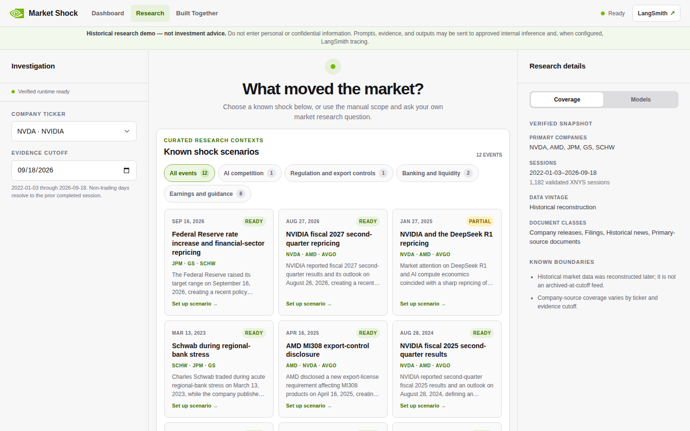
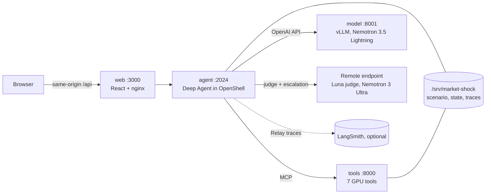

<p align="center">
  
  &nbsp;&nbsp;&nbsp;×&nbsp;&nbsp;&nbsp;
  
</p>

<h1 align="center">Market Shock Investigator</h1>

A financial research agent for one NVIDIA DGX Spark. You pick a curated market
shock (or name a supported company and date), ask a question, and a LangChain
Deep Agent reads a research skill, calls GPU-backed evidence tools, and returns
a cited answer with a timeline of every model and tool call.

> This is a supervised booth demo, validated on one prepared DGX Spark. It is not
> a hosted or multi-user service, and its answers are not investment advice.

<p align="center"></p>

## What it does

- **Deep Agent with skills.** `create_deep_agent` lists the seven skill
  descriptions; the model picks one and reads its `SKILL.md`. All seven
  read-only evidence tools are available. Tool wrappers, not the model, set the
  evidence cutoff, keep tickers inside the investigation, cap and dedupe calls,
  and reject evidence dated after the cutoff.
- **Typed, cited answers.** The final answer is structured output. The report
  keeps only citation IDs the tools actually returned and fails the turn if the
  tools returned evidence and none of it was cited.
- **Every step routed by NeMo Switchyard.** Local Nemotron 3.5 Lightning produces
  each step; a remote judge (`openai/openai/gpt-5.6-luna`) decides whether remote
  Nemotron 3 Ultra should redo it. If the judge's verdict is unreadable, the step
  fails.
- **Traced and sandboxed.** NeMo Relay records one span per agent step and one
  per physical model call, with optional LangSmith export. The agent runs only
  inside an NVIDIA OpenShell 0.0.116 sandbox.

**What is local and what is not.** Lightning, the embedding model, the tools,
and all data run on the Spark, and startup never builds or downloads anything.
Research does need the remote endpoint, because the judge reviews every step.
With `REMOTE_ROUTING_ENABLED=false` the app starts as "prepared, research
disabled": the dashboard works, and investigations are refused.

## Architecture



| Role | What it runs | Boundary |
| --- | --- | --- |
| `web:3000` | React UI, nginx proxy of `/api` to the agent | Only published port (`127.0.0.1:3000`) |
| `agent:2024` | FastAPI app, Deep Agent, Switchyard, Relay, encrypted state | OpenShell sandbox; no unsandboxed fallback |
| `tools:8000` | MCP server with seven read-only tools | Private network; only the agent calls it |
| `model:8001` | vLLM serving Lightning with a speculative draft model | Private network; only the agent calls it |

Compose runs `web`, `tools`, and `model`. OpenShell runs the agent. See
[Architecture](docs/ARCHITECTURE.md) for the step-by-step request flow.

## Repository map

| Area | Where |
| --- | --- |
| UI (Dashboard, Research, Built Together) | `apps/web/` |
| HTTP API (investigations, SSE, status) | `services/agent/src/market_agent/app.py` |
| Agent construction | `services/agent/src/market_agent/agent.py` |
| Evidence tool wrappers (cutoff, scope, limits) | `services/agent/src/market_agent/tools.py` |
| Switchyard routing and model-call spans | `services/agent/src/market_agent/routing.py` |
| Scope resolution, report building, turn runner | `scope.py`, `report.py`, `runner.py` in the same package |
| System and judge prompts | `services/agent/src/market_agent/prompts/` |
| Skills | `services/agent/skills/*/SKILL.md` |
| GPU tools service (MCP) | `services/tools/src/market_tools/` |
| Settings and model IDs | `services/agent/src/market_agent/config.py` |
| Operator settings | `.env.spark.example`, `compose.yaml` |
| OpenShell policy and gateway | `scripts/spark/openshell/` |
| Operator scripts | `demo`, `scripts/spark/` |
| Curated events and data sources | `data/` |
| Tests | `tests/` |

## Skills and tools

| Skill | Suggested tools |
| --- | --- |
| `market-dislocation` | `get_price_context`, `detect_market_shock`, `search_news` |
| `peer-comparison` | `get_price_context`, `detect_market_shock`, `search_news` |
| `historical-analogues` | `get_price_context`, `detect_market_shock`, `find_historical_analogues` |
| `comovement` | `get_price_context`, `detect_market_shock`, `map_comovement`, `search_news` |
| `volatility-risk` | `detect_market_shock`, `predict_volatility_risk`, `search_news` |
| `narrative-map` | `search_news`, `project_news_topics`, `get_price_context` |
| `research-guide` | none (greetings, missing company or date, out-of-scope requests) |

A skill's `allowed-tools` list is guidance for the model. The code does not
enforce it: all seven tools are bound for every turn.

## Models

| Where | Role | Model |
| --- | --- | --- |
| Spark | Agent reasoning | `nvidia/NVIDIA-Nemotron-3.5-Lightning-30B-A3B-NVFP4@bee7596271d1495f6992ae224aefde4410e816b8` |
| Spark | Speculative draft | `nvidia/NVIDIA-Nemotron-3.5-Lightning-30B-A3B-NVFP4-DSpark@8a0177116d138011e63103110f136ec0ca09ebbf` |
| Spark | Embeddings | `nvidia/Nemotron-3-Embed-1B-BF16@9e0b24858b1195815ecb1188ffa1b73bcea7b30a` |
| Remote | Switchyard judge | `openai/openai/gpt-5.6-luna` |
| Remote | Escalated reasoning | `nvidia/nvidia/nemotron-3-ultra` |

Remote calls send the conversation and tool evidence to the configured endpoint.

## Data

This is a small, prepared dataset:

- Five target companies (NVDA, AMD, JPM, GS, SCHW) plus AVGO as a peer, about
  10.6k daily bars. The prices are a later reconstruction from a CC0 Kaggle
  dataset, not an archive captured on each date.
- 494 documents, mostly SEC filing metadata, plus a few company releases and 12
  curated one-sentence news summaries.
- 12 curated shock events in `data/events/catalog.yaml`.

GPU use is real but small: Nemotron embeddings with cuVS vector search, cuML
UMAP for the topic map, CUDA XGBoost for volatility risk, cuGraph on a small
return-correlation network, and cuDF for features.

## Quick start

Model weights, credentials, and the prepared `/srv/market-shock` runtime are not
in this repository, so these commands only work on a Spark that was already
provisioned. The full sequence is in [Operations](docs/OPERATIONS.md).

```bash
cp .env.spark.example .env        # set REMOTE_ROUTING_ENABLED=true, NVIDIA_BASE_URL, NVIDIA_INFERENCE_API_KEY
./demo start                      # add --recreate-agent after a reboot or an OpenShell re-prepare
./demo doctor                     # readiness checks; never prints secrets
./demo stop
```

Open <http://localhost:3000> once startup prints `READY FOR DEMO`.

## Testing

```bash
# Agent, operator-script, and CPU tool tests (as in CI)
PYTHONPATH=services/agent/src:services/tools/src:. \
  uv run --project services/agent --with pytest --with pytest-asyncio --with numpy \
  pytest tests/agent tests/unit tests/tools

# GPU tool tests inside the tools image, on a prepared Spark
scripts/spark/test-tools-gpu.sh

# Web
corepack pnpm@9.15.9 --dir apps/web install --frozen-lockfile
corepack pnpm@9.15.9 --dir apps/web test -- --run
corepack pnpm@9.15.9 --dir apps/web typecheck
```

CI (`.github/workflows/quality.yaml`) runs `ruff check` on `scripts` and `tests`,
`ruff format --check` on `services`, `scripts`, and `tests`, the Python tests
above, and the web test, typecheck, and build.

## Documentation

- [Architecture](docs/ARCHITECTURE.md): request flow, trust boundaries, what runs locally
- [Operations](docs/OPERATIONS.md): start, stop, doctor, recovery, troubleshooting
- [Demo walkthrough](docs/DEMO_WALKTHROUGH.md): presenter script

## License

[Apache License 2.0](LICENSE). Third-party attributions are in
[THIRD_PARTY_NOTICES.md](THIRD_PARTY_NOTICES.md).
