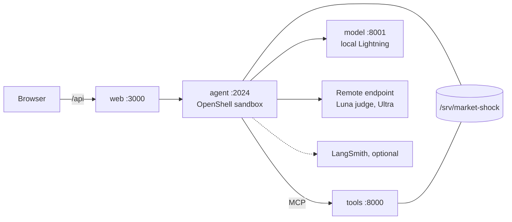

# Architecture

Four application roles run on one DGX Spark. The browser talks only to `web`.
The agent does the reasoning and orchestration, the tools service computes
evidence on the GPU, and vLLM serves the local model.

| Role | Code | Runs under |
| --- | --- | --- |
| `web:3000` | `apps/web/` (nginx config: `apps/web/nginx.conf`) | Compose; published only on `127.0.0.1:3000` |
| `agent:2024` | `services/agent/src/market_agent/` | OpenShell 0.0.116 sandbox |
| `tools:8000` | `services/tools/src/market_tools/` | Compose, private network |
| `model:8001` | vLLM image and command in `compose.yaml` | Compose, private network |

## Request flow

1. **Browser to agent.** The UI calls `POST /api/investigations`. nginx proxies
   `/api/` to `http://agent:2024/api/`. The browser never sees model, MCP, or
   credential details.
2. **Scope.** `app.py` calls `scope.resolve` (`scope.py`). A curated event fixes
   the companies, cutoff, and market session. Otherwise the UI's ticker and date
   are used, or tickers, company names, and dates found in the question. At most
   five companies are kept. If the company or date is missing, the scope is
   `needs_input` and the agent is told to ask for it. An unknown event returns 422.
3. **Start.** If remote routing is off, the API returns 503. If another turn is
   running, it returns 409. Otherwise `runner.Runner.start` saves the turn and
   runs it as a background task, and the API returns 202. One turn runs at a
   time because the GPU and local model are shared.
4. **Agent.** `agent.MarketAgent` is built with `create_deep_agent`:
   - The system prompt is `prompts/system.md`. A dynamic prompt appends the
     turn's scope, cutoff, and coverage (`briefing`).
   - The default SkillsMiddleware lists the skill descriptions from
     `services/agent/skills/`. The model chooses a skill and loads its
     `SKILL.md` with `read_file`. The filesystem is read-only and limited to
     `/skills/`. Write, edit, execute, glob, and grep are excluded, and there is
     no general-purpose subagent.
   - Summarization is off because it would call the model outside Switchyard.
   - Limits: 14 model calls and 24 tool calls per run, with a recursion limit of 80.
5. **Routing each step.** `routing.switchyard_middleware` wraps every model
   step in Switchyard's escalation classifier:
   - Local Lightning (`model:8001`) produces the step.
   - The remote judge `openai/openai/gpt-5.6-luna` reads the step
     (`prompts/escalation.md`) and decides whether to escalate.
   - If it escalates, remote `nvidia/nvidia/nemotron-3-ultra` redoes the step.
   - `VerifiedClient` rejects a response whose reported model differs from the
     one requested (`identity_mismatch`).
   - An unreadable judge verdict fails the step (`judge_verdict_invalid`). The
     step never falls back silently to the local answer.
   - A remote connection error is retried once. Local calls are not retried.
6. **Tools.** The seven tools in `tools.py` all go through `call_tool`, which:
   - blocks calls when the scope is unresolved or the ticker is outside it;
   - injects the cutoff (market tools use the session close, and document tools
     use the evidence cutoff);
   - dedupes identical calls and caps a turn at 16 distinct calls;
   - calls MCP at `http://tools:8000/mcp`;
   - rejects results containing citations dated after the cutoff;
   - keeps the full result in the turn's ledger and gives the model a compact view.
7. **Answer.** The agent finishes with `ToolStrategy(Answer)`, a structured
   answer with citation IDs, uncertainty, and suggested questions. If there is
   no structured answer, the turn fails with `no_answer`.
8. **Report.** `report.build_report` keeps only citation IDs that tools returned
   in this turn. It fails with `uncited_answer` if tools returned citations and
   the answer cited none. Tool limitations and failures are added to the report.
9. **Progress.** Turn, skill, model, and tool spans are appended to the
   encrypted event log. They are streamed from
   `GET /api/investigations/{id}/stream` (SSE, resumable with `Last-Event-ID`),
   which ends with a `done` event.

Follow-ups (`POST .../turns`) carry the scope forward and add any newly named
company or date. An investigation holds up to four questions. `POST .../retry`
removes the failed turn's messages from the checkpoint and runs the turn again.
`POST .../cancel` stops the running turn.

### API

| Endpoint | Purpose |
| --- | --- |
| `GET /api/status` | Readiness, the reason when not ready, companies, coverage, models, LangSmith link |
| `GET /api/shock-events` | Curated event catalog (503 if unavailable) |
| `GET /api/dashboard?ticker=&as_of=` | Dashboard data, read from the tools MCP resource `market://dashboard/{ticker}/{as_of}` |
| `POST /api/investigations` | Start an investigation (202) |
| `GET /api/investigations/{id}` | Investigation with its events |
| `POST /api/investigations/{id}/turns` | Follow-up question (202) |
| `POST /api/investigations/{id}/retry` | Retry a failed or cancelled turn (202) |
| `POST /api/investigations/{id}/cancel` | Cancel the running turn |
| `GET /api/investigations/{id}/stream` | SSE progress |
| `GET /health/live`, `GET /health/ready` | Liveness and readiness (not proxied under `/api`) |

## Tools service

`services/tools/src/market_tools/server.py` is a Streamable HTTP MCP server with
seven read-only tools. At startup it loads the prepared scenario and runs every
tool once. `/health` is not ready until each tool has produced a GPU result.

| Tool | GPU work |
| --- | --- |
| `get_price_context`, `detect_market_shock` | cuDF features over daily bars |
| `find_historical_analogues` | cuDF/CuPy distances to earlier sessions by return, relative return, and volume |
| `map_comovement` | cuGraph BFS (up to two links) on a small prior-return correlation network; shows shared exposure, not causation |
| `predict_volatility_risk` | CUDA XGBoost model trained on data before the cutoff |
| `search_news` | Nemotron 3 Embed query embedding and cuVS search over prepared document vectors |
| `project_news_topics` | cuML UMAP of stored document embeddings |

The GPU base image (CUDA, PyTorch, RAPIDS, XGBoost, Sentence Transformers) is
defined in `services/tools/base.Dockerfile`.

## State and observability

- **State.** `/srv/market-shock/state` holds `agent-v2.sqlite3` (investigations
  and events) and `checkpoints-v2.sqlite3` (LangGraph checkpoints). Both are
  encrypted with AES-GCM using `agent.key` from the same directory, which
  protects against casual reads only: anyone who can read the key file can read
  the data. `store.Store` refuses to store any configured secret value.
- **Tracing.** `relay_tracing.py` writes NeMo Relay traces to
  `/srv/market-shock/traces`. Relay's Deep Agents integration adds one span per
  agent step, and `routing._observed` adds one span per physical model call.
  When `LANGSMITH_TRACING=true` and the key is set, the same trace hierarchy is
  exported to LangSmith.

## Trust boundaries

- **Browser.** Talks only to `web` on `127.0.0.1:3000` (`/api` is proxied).
  `scripts/spark/process_contract.py` checks that no other service publishes a port.
- **Agent sandbox.** OpenShell owns the agent. `scripts/spark/openshell/policy.yaml`
  makes the application, scenario, and event catalog read-only and allows writes
  only to `state`, `traces`, and `/tmp`. Network egress is limited to `tools:8000`,
  `model:8001`, and the endpoints of the configured providers.
  `scripts/spark/openshell_runtime.py` never starts an unsandboxed agent.
- **Credentials.** `scripts/spark/openshell_config.py` reads the env file and
  stores `NVIDIA_INFERENCE_API_KEY` and `LANGSMITH_API_KEY` only in
  endpoint-bound OpenShell providers. They never go to web, tools, model, the
  images, or the browser.
- **Tools and model.** Neither holds credentials or calls remote inference.
- **Gateway.** The OpenShell gateway binds to `127.0.0.1:17671`
  (`scripts/spark/openshell/gateway.toml`). It is a workstation-local control
  plane, not an authenticated multi-user service. Do not expose it.
- **Evidence.** The model is told that tool output is data, not instructions.
  The wrappers set the cutoff and scope, so the model cannot widen either.

## What is local and what is not

| Local on the Spark | Remote |
| --- | --- |
| Nemotron 3.5 Lightning plus its speculative draft (vLLM) | Luna judge, called on every agent step |
| Nemotron 3 Embed, cuVS, cuML, cuGraph, XGBoost, cuDF | Nemotron 3 Ultra, called when the judge escalates |
| Scenario data, event catalog, encrypted state, Relay traces | LangSmith export (optional) |

Startup is offline: it uses local images and prepared artifacts and never builds,
pulls, or downloads. Research is not offline. Each step needs the judge, and
remote calls send the conversation and tool evidence to the endpoint. With
`REMOTE_ROUTING_ENABLED=false`, the agent builds no graph. `/api/status` then
reports `ready: false` with the reason, and investigation requests return 503.
The dashboard and the event catalog still work.

## Data limits

Prices are a later reconstruction of daily bars (Kaggle, CC0), not an archive
captured on each date. The documents are mostly SEC filing metadata, plus a few
company releases and 12 curated one-sentence news summaries. The coverage is
five target companies plus AVGO as a peer: about 10.6k daily bars and 494
documents. A cutoff filter enforces what was *available* by a time. It cannot
make reconstructed data historical.
