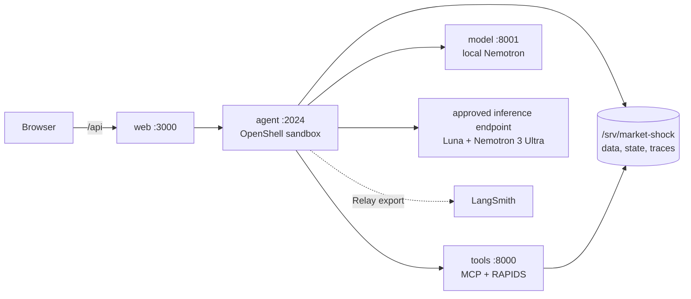

# Architecture

Market Shock Investigator is a four-role application built for one prepared
NVIDIA DGX Spark. The browser talks to a single same-origin endpoint. The agent
owns reasoning and orchestration, typed tools own evidence computation, and a
local vLLM server owns efficient generation.

## Runtime roles

| Role | Responsibility | Boundary |
| --- | --- | --- |
| `web:3000` | React experience and reverse proxy | Only host-published application port |
| `agent:2024` | Deep Agent, skills, routing, tracing, state, and streaming API | OpenShell-managed sandbox; no unsandboxed fallback |
| `tools:8000` | Seven read-only market and evidence tools | Private network, reachable only by the agent |
| `model:8001` | Local Nemotron generation through vLLM | Private network, reachable only by the agent |

Docker Compose owns `web`, `tools`, and `model`. Its `agent` definition is an
image role only. OpenShell owns the running agent, its filesystem permissions,
and its explicit endpoint policy.

## Agent construction

`services/agent/src/market_agent/deep_runtime.py` creates the LangChain Deep
Agent. Middleware supplies three important boundaries:

1. A request-specific skill narrows the research behavior and available tools.
2. `SwitchyardRoutingMiddleware` sends every logical model call through the
   escalation route.
3. NeMo Relay records the agent, model, and tool hierarchy and can export that
   hierarchy to LangSmith.

The efficient target is local Nemotron 3.5 Lightning. GPT-5.6 Luna, hosted on an
approved inference endpoint, decides whether the local result is sufficient.
When it is not, Switchyard calls Nemotron 3 Ultra on that same endpoint. There is
no unlisted fallback model.

## Evidence and tools

The agent reaches one Streamable HTTP MCP server. Tools expose typed outcomes
instead of prose and return explicit `ok`, `partial`, or `no_data` states. The
tool layer uses:

- cuDF for columnar market operations;
- cuVS and Nemotron 3 Embed for evidence retrieval;
- cuGraph for bounded relationship paths;
- cuML for topic projections;
- CUDA XGBoost for the prepared risk workflow.

Every request includes an evidence cutoff. Artifact contracts bind rows,
documents, derived features, and citations to the prepared scenario, and the
tools reject evidence that was not available by that cutoff.

## State and observability

Investigation state is encrypted and persisted under `/srv/market-shock/state`.
Relay writes local append-only traces under `/srv/market-shock/traces`. When an
endpoint-bound LangSmith provider is enabled, the same correlated hierarchy is
exported without giving the browser a credential.

The UI renders progress from the public SSE stream. Its timing view reflects the
actual policy, model, tool, and presentation spans rather than a synthetic demo
sequence.

## Security posture

- The browser receives no model, MCP, or credential address.
- Tools cannot call inference providers.
- The agent receives only the provider placeholders granted by OpenShell.
- Startup verifies exact image, model, scenario, and OpenShell receipts.
- Identity drift and unavailable approved routes fail closed.
- The OpenShell gateway is a loopback workstation control plane and must not be
  exposed to a LAN or the Internet.

This is a supervised workstation demo, not a hardened multi-user service.
